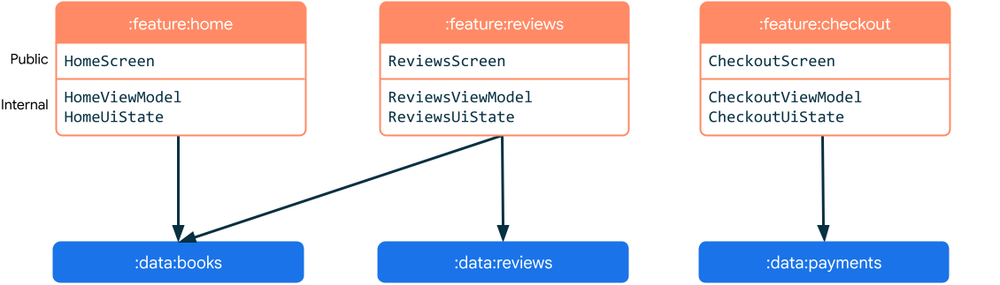

# An example of Android multi-module project architecture using MVVM/MVI design patterns + Clean Architecture + Jetpack Compose (UI) for client-server apps


More information: https://developer.android.com/topic/architecture


More information: https://blog.cleancoder.com/uncle-bob/2012/08/13/the-clean-architecture.html

App modularization:


More information: https://developer.android.com/topic/modularization
Common patterns: https://developer.android.com/topic/modularization/patterns

Android development language: **Kotlin** (https://kotlinlang.org/)

Base Android modern technology stack:
* Jetpack Compose + Material 3
* Hilt
* Kotlin Coroutines + Flow
* DataStore, Room Database
* OkHttp + Retrofit 2
* plus others Android Jetpack libraries

This Android project app is built from the following modules:
* app
* designsystem (theme for app, main composable components like buttons and so on)
* ui (reusable UI composables, general UI utils)
* common
* data (repository)
* database (using Room)
* network (using OkHttp + Retrofit 2)
* datastore, datastore-test (for local data storage)
* domain (use cases, the module contains application specific business rules, it encapsulates and implements all of the use cases of the system)
* entities (encapsulate Enterprise wide business rules)
* feature/* (a feature implements a specific screen)
* translations (strings in xml files to translate the app)
* testing
* build-logic (Gradle Kotlin DSL plugins)

There are some unit tests, but the work is still in progress — more will be added later.

To make the app fetch data from the network data store, you need to add your Unsplash API keys (https://unsplash.com/developers) to *local.properties*:
```
UNSPLASH_API_ACCESS_KEY=test
UNSPLASH_API_SECRET_KEY=test
```


Below are some explanations of the modules and code examples (it can be similar to the project code itself, just to illustrate the idea, but some examples here might be outdated, so it's better to check the actual project code).

 **app** module contains single activity for the whole app:
````
@AndroidEntryPoint
class MainActivity : ComponentActivity() {
    override fun onCreate(savedInstanceState: Bundle?) {
        installSplashScreen()
        super.onCreate(savedInstanceState)

        enableEdgeToEdge(
            statusBarStyle = SystemBarStyle.auto(Color.TRANSPARENT, Color.TRANSPARENT),
            navigationBarStyle = SystemBarStyle.auto(Color.TRANSPARENT, Color.TRANSPARENT),
        )

        setContent {
            ArchApp()
        }
    }
}
````

We use *SplashScreen* support library (`installSplashScreen()`) which works for Android 6+ to get the same splash results.

In `ArchApp` comoposable function we call `AppNavGraph` composable function to implement navigation (it implements navigation graph using Navigation Compose library):
```
AppNavGraph(
    startDestination = startDestination,
    navController = appState.navController,
    onLogout = appViewModel::logout,
    modifier = Modifier.fillMaxSize()
)
```

Implementation example:

```
@Composable
fun AppNavGraph(
    ...
) {
    NavHost(
        modifier = modifier,
        navController = navController,
        startDestination = startDestination,
    ) {
        onBoardingScreen()
        welcomeScreen(
            navigateToLogin = {
                navController.navigateToLogin(
                    navOptions = NavOptions.Builder()
                        .apply { setPopUpTo(route = Welcome.route, inclusive = true) }
                        .build()
                )
            },
            navigateToSignUp = navController::navigateToSignUpGraph
        )
        loginScreen(
            navigateToSignUp = navController::navigateToSignUpGraph,
            navigateToForgotPassword = navController::navigateToForgotPasswordGraph
        )
```

 **designsystem** module contains app theme (sets colors, text styles (typography), shapes), reused main base components (buttons, bars, dividers, dialogs and so on)

for example this module can contain `common_ui/components/Buttons.kt` file to implement buttons which are used across many screens and also add the preview of this button:
```
@Composable
fun AppFilledButton(
    text: String,
    modifier: Modifier = Modifier,
    onClick: () -> Unit,
    enabled: Boolean = true,
    progressLoading: Boolean = false
) {
    Button(
        modifier = modifier,
        enabled = enabled,
        colors = ButtonDefaults.buttonColors(
            ...
         ),
        onClick = onClick
    ) {
        if (progressLoading) {
            CircularProgressIndicator(
                modifier = Modifier.size(24.dp),
                color = ...
            )
        } else {
            Text(
                text = text,
                ...
            )
        }
    }
}

@Composable
@Preview(heightDp = 100) // and additionally dark mode preview
private fun AppFilledButtonPreview() {
    AppTheme {
        AppGradientBackground {
            Box(modifier = Modifier.padding(24.dp)) {
                AppFilledButton(
                    text = "Filled button",
                    onClick = {}
                )
            }
        }
    }
}
```
 **ui** module contains UI which can be used in different features (e.g.: a list item), some general utils: UI Kotlin extensions, Format Utils (e.g.: date time, decimal values format)
 
 **core** module is being used by many other modules, it contains implementations which can be needed in any module (Kotlin Coroutine Dispatchers, Extensions, Result wrapper data class)
 
 **domain** module contains use cases, application specific business actions, for example if we have need to know which work skills have been selected by a user from all available skills we can implement the following use case:
```
class GetMyWorkSkillsUseCase @Inject constructor(
    private val profileRepository: ProfileRepository,
    private val listRepository: ListRepository
) {
    operator fun invoke(): Flow<Result<List<SelectedWorkSkill>>> {
        return combine(
            listRepository.getWorkSkills(),
            profileRepository.getWorkSkills()
        ) { allSkills, mySkills ->
            allSkills.map { skill ->
                SelectedWorkSkill(
                    workSkill = skill,
                    selected = skill in mySkills
                )
            }
        }.wrapAsResult()
    }
}
```
and then use it in the `ViewModel`:
```
fun getMyWorkSkills() {
    ...
    myWorkSkillsJob = viewModelScope.launch {
        getMyWorkSkillsUseCase().collect {
            // map to UI state
        }
    }
}
```
 **repository** module encapsulates the logic to get data from different sources (network, database, local storage)

The example implementation:

Follow SOLID’s dependency inversion principle to introduce interfaces between a higher-level class and its dependencies. That decouples the higher-level class from its dependencies so that you can change the code of a lower-level class without changing the code that uses it. The only code that uses a dependency directly is the one that instantiates an object of a specific class that implements the interface.
The dependency injection technique enables you to improve this even further. It provides a way to separate the creation of an object from its usage. By doing that, you can replace a dependency without changing any code and it also reduces the boilerplate code in your business logic.

```
interface AuthRepository {

    fun login(email: String, password: String): Flow<Unit>
}
```
Implementation:
```
class AuthRepositoryImpl @Inject constructor(
    private val authNetworkDataSource: AuthNetworkDataSource,
    private val userDataStoreManager: UserDataStoreManager
) : AuthRepository {
    override fun login(email: String, password: String): Flow<Unit> = flow {
        val loginResponse = authDataSource.login(email, password)
            .asExternalModel() // use separate network models and then map them to POJO business external models
        saveUserData(loginResponse)
        emit(Unit)
    }

    private suspend fun saveUserAuthData(loginResponse: LoginResponse) {
        userDataStoreManager.setUserData(user = loginResponse.user)
    }
}
```
Dependency Injection:
```
@Binds
fun bindAuthRepositoryImpl(impl: AuthRepositoryImpl): AuthRepository
```
 **database** module caches the data from network module which then can be used offline.
Example using Room + Kotlin Coroutines + Flow:
Dao (Data Access Objects are the main classes where you define your database interactions):
```
@Dao
interface TopicDao {

    // TODO: don't use REPLACE strategy if you have relations with the data, use Insert and Update in transaction method to save topics
    @Insert(onConflict = OnConflictStrategy.REPLACE)
    suspend fun insertAll(topics: List<DbTopicEntity>): List<Long>

    @Query("SELECT * FROM topics")
    fun getAll(): Flow<List<DbTopicEntity>>

    @Query("SELECT * FROM topics WHERE id=:id")
    fun getTopicById(id: String): Flow<DbTopicEntity>

    @Query("DELETE FROM topics")
    suspend fun deleteAll(): Int // or return nothing if no need to know count of deleted rows

    @Transaction
    suspend fun deleteAllAndAddNewTopics(topics: List<DbTopicEntity>) {
        // Anything inside this method runs in a single transaction.
        deleteAll()
        insertAll(topics)
    }
}
```
Database + tables init:
```
@Database(
    entities = [DbTopicEntity::class],
    version = 1,
    exportSchema = true
)
@TypeConverters(Converters::class)
abstract class AppDataBase : RoomDatabase() {

    abstract fun getTopicsDao(): TopicDao

    companion object {
        fun getInstance(context: Context) =
            Room.databaseBuilder(context, AppDataBase::class.java, NAME)
                .build()

        private const val NAME = "database"
    }
}
```
Manager:
```
interface TopicDbManager {
    fun getAllTopics(): Flow<List<Topic>>

    fun getTopicById(id: String): Flow<Topic>

    suspend fun deleteAllAndAddNewTopics(topics: List<Topic>)
}
```
DI:
```
@InstallIn(SingletonComponent::class)
@Module
object DatabaseModule {
    @Provides
    @Singleton
    fun provideDataBase(@ApplicationContext context: Context): AppDataBase {
        return AppDataBase.getInstance(context)
    }

    @Provides
    fun provideTopicsDao(dataBase: AppDataBase): TopicDao = dataBase.getTopicsDao()

    @Provides
    fun provideTopicDbManager(topicDao: TopicDao): TopicDbManager = TopicDbManagerImpl(topicDao)
}
```
 **network** module is used to fetch data from server (REST API/WebSockets).
Example implementation:
Interface:
```
interface AuthNetworkDataSource {

    suspend fun login(email: String, password: String): LoginResponse
}
```
Implementation:
```
class AuthNetworkDataSourceImpl(
    private val authApi: AuthApi,
    private val networkErrorConverterHelper: NetworkErrorConverterHelper
) : AuthNetworkDataSource {

    override suspend fun login(email: String, password: String): NetworkLoginResponse = try {
        val response = authApi.login(
            NetworkLoginRequest(
                email = email,
                password = password
            )
        )
        response.data
    } catch (e: Throwable) {
        throw networkErrorConverterHelper.parseError(e)
    }
}
```
REST API using Retrofit + Kotlin Coroutines:
```
interface AuthApi {

    @Headers("$HEADER_NO_AUTHENTICATION: true")
    @POST("auth/login")
    suspend fun login(@Body loginRequest: NetworkLoginRequest): NetworkLoginResponse

    @POST("auth/logout")
    suspend fun logout()
}
```
Adding a bearer authorization token using OkHttp interceptor:
```
class AddTokenInterceptor @Inject constructor(
    private val preferencesManager: PreferencesManager
) : Interceptor {
    override fun intercept(chain: Interceptor.Chain): Response {
        var request = chain.request()
        val noAuth = request.header(HEADER_NO_AUTHENTICATION)?.toBoolean() ?: false
        if (!noAuth) {
            // we already on the background thread
            val token = runBlocking { preferencesManager.getPreferences().first().token }
            token?.let {
                request = request.newBuilder()
                    .addHeader(HEADER_AUTHORIZATION, "Bearer $it")
                    .build()
            }
        }
        return chain.proceed(request)
    }
}
```
DI:
```
@Provides
@Singleton
fun providesOkHttpClient(
    httpLoggingInterceptor: HttpLoggingInterceptor,
    addTokenInterceptor: AddTokenInterceptor,
    headerInterceptor: HeaderInterceptor
): OkHttpClient = OkHttpClient.Builder()
    ...
    .build()

@Provides
@Singleton
fun provideRetrofit(
    moshi: Moshi,
    client: OkHttpClient,
    queryConverterFactory: Converter.Factory
): Retrofit = Retrofit.Builder()
    .baseUrl(BuildConfig.BASE_URL)
    ...
    .build()
	
@Provides
@Singleton
fun providesMoshi() = Moshi.Builder()
    .add(DateTimeTypeAdapter())
    ...
    .build()

@Provides
fun provideAuthApi(retrofit: Retrofit): AuthApi = retrofit.create(AuthApi::class.java)

@Provides
fun provideAuthDataSource(
    authApi: AuthApi,
    networkErrorConverterHelper: NetworkErrorConverterHelper
): AuthDataSource =
    AuthDataSourceImpl(authApi, networkErrorConverterHelper)
```
 **datastore** module contains implementations to save and retrieve data from local phone storage. 
Jetpack DataStore is a data storage solution that allows you to store key-value pairs or typed objects with protocol buffers. DataStore uses Kotlin coroutines and Flow to store data asynchronously, consistently, and transactionally.
For example to save `User` data we can use the following implementation.
*DI:*
```
private const val USER_DATASTORE_FILE_NAME = "user.pb"

@Module
@InstallIn(SingletonComponent::class)
object DataStoreModule {

    @Provides
    @Singleton
    internal fun providesUserDataStore(
        @ApplicationContext context: Context,
        @Dispatcher(AppDispatchers.Default) ioDispatcher: CoroutineDispatcher,
        @ApplicationScope scope: CoroutineScope,
        serializer: UserDataSerializer
    ): DataStore<User> =
        DataStoreFactory.create(
            serializer = serializer,
            scope = CoroutineScope(scope.coroutineContext + ioDispatcher),
            corruptionHandler = ReplaceFileCorruptionHandler {
                serializer.defaultValue
            },
        ) {
            context.dataStoreFile(USER_DATASTORE_FILE_NAME)
        }

    @Provides
    internal fun provideUserDataManager(
        datastore: DataStore<User>,
    ): UserDataStore = UserDataStoreImpl(datastore)
}
```
*Manager Interface**:
```
interface UserManager {
    fun getUser(): Flow<User>
    suspend fun setUser(user: User)
}
```
*Manager Implementation*:
```
class UserManagerImpl(
    private val dataStore: DataStore<User>
) : UserManager {

    override fun getUser(): Flow<User> = dataStore.data

    override suspend fun setUser(user: User) {
        dataStore.updateData { user }
    }
}
```
*Usel Model Serializer*:
```
class UserSerializer @Inject constructor() : Serializer<User> {
    override val defaultValue: User
        get() = User()

    override suspend fun readFrom(input: InputStream): User {
        return try {
            ProtoBuf.decodeFromByteArray(input.readBytes())
        } catch (e: SerializationException) {
            e.printStackTrace()
            throw CorruptionException("The data could not be de-serialized", e)
        }
    }

    override suspend fun writeTo(t: User, output: OutputStream) {
        output.write(ProtoBuf.encodeToByteArray(t))
    }
}
```

 **domain** module. The domain layer is an optional layer that sits between the UI layer and the data layer.


The domain layer is responsible for encapsulating complex business logic, or simple business logic that is reused by multiple ViewModels. This layer is optional because not all apps will have these requirements. You should only use it when needed-for example, to handle complexity or favor reusability.

A domain layer provides the following benefits:
- It avoids code duplication.
- It improves readability in classes that use domain layer classes.
- It improves the testability of the app.
- It avoids large classes by allowing you to split responsibilities.

To keep these classes simple and lightweight, each use case should only have responsibility over a single functionality, and they should not contain mutable data. You should instead handle mutable data in your UI or data layers.

More info at https://developer.android.com/topic/architecture/domain-layer

Example:
```
class GetMyWorkSkillsUseCase @Inject constructor(
    private val profileRepository: ProfileRepository,
    private val listRepository: ListRepository
) {
    operator fun invoke(): Flow<Result<List<SelectedWorkSkill>>> {
        return combine(
            listRepository.getWorkSkills(),
            profileRepository.getWorkSkills()
        ) { allSkills, mySkills ->
            allSkills.map { skill ->
                SelectedWorkSkill(
                    workSkill = skill,
                    selected = skill in mySkills
                )
            }
        }.wrapAsResult()
    }
}
```

 **feature/submodule** - A feature is an isolated part of an app's functionality that usually corresponds to a screen or series of closely related screens, like a sign up or checkout flow. If your app has a bottom bar navigation, it’s likely that each destination is a feature.

Features are associated with screens or destinations in your app. Therefore, they're likely to have an associated UI and ViewModel to handle their logic and state. A single feature doesn't have to be limited to a single view or navigation destination. Feature modules depend on data modules.

Sample feature modules and their content:


An example structure:


MVI:


 **entities** module.
Entities represent the core concepts and rules of your system, regardless of the specific use cases that the system will support.

Example entity:
```
data class User(
    val id: Long,
    val name: String,
    val email: String,
    val avatar: String?,
)
```

 **translations** - for easier app translations to different languages we put all strings in one strings.xml file of a separate translations module (`translations/src/main/res/values-*/strings.xml`)
 